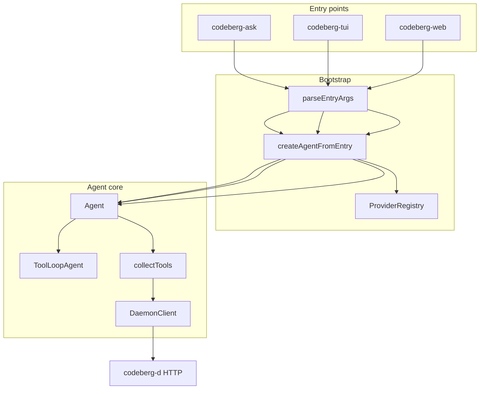

# Codeberg agent

Token-efficient code-search agent over `codeberg-d`, built with [ai-sdk](https://sdk.vercel.ai).

## Install

```sh
cd agent && npm install && npm run build
```

Requires a running `codeberg-d`. Semantic search (`search_code`) needs vector indexing
(`CBERG_MODEL` + `CBERG_INDEX_PATH` on the daemon); file and chunk tools work in
chunk-only mode.

## Environment variables

All three binaries (`codeberg-ask`, `codeberg-tui`, `codeberg-web`) read the
same core set; `codeberg-web` reads a few more of its own. The `codeberg`
launcher sets these for you — this table is for running the agent standalone
or from a checkout.

| Variable | Binaries | Purpose |
|---|---|---|
| `CODEBERG_MODEL` | all | `provider:model`, overrides the positional argument |
| `CODEBERG_DAEMON_URL` | all | daemon endpoint (default `http://127.0.0.1:8080`) |
| `CODEBERG_QUESTION` | CLI | the question, overrides the positional argument |
| `CODEBERG_HOME` | TUI, web | state root for sessions (default `~/.codeberg`) |
| `CODEBERG_REASONING` | all | reasoning effort: `provider-default`, `none`, `minimal`, `low`, `medium`, `high`, `xhigh`; anything else is ignored |
| `CODEBERG_CONTEXT_WINDOW` | all | override the model's inferred context window (tokens) — mainly for local `ollama`/`llamacpp` servers, whose real window depends on how they were started |
| `CODEBERG_WEB_USE` | all | master switch for `fetch_url`/`web_search` (default on; `0`/`false`/`off`/`no` disables) |
| `CODEBERG_SEARXNG_URL` | all | SearXNG endpoint backing `web_search` |
| `CODEBERG_WEB_ALLOW_PRIVATE` | all | allow `fetch_url` to hit loopback/private hosts (default off) |
| `CODEBERG_WEB_MAX_BYTES` | all | `fetch_url` raw-body cap (default 1.5 MB) |
| `CODEBERG_WEB_MAX_CHARS` | all | `fetch_url` extracted-text cap (default 20,000 chars) |
| `CODEBERG_WEB_TIMEOUT_MS` | all | `fetch_url`/`web_search` HTTP timeout (default 15,000) |
| `CODEBERG_WEB_SEARCH_COUNT` | all | `web_search` result count (default 6) |
| `CODEBERG_WEB_PORT` / `PORT` | web | listen port (default 48088) |
| `CODEBERG_WEB_ROOT` | web | prebuilt SPA directory (default `../web-ui/dist`) |

## CLI

Single-shot questions — one call to `ChatSession.ask`, print the answer +
sources, exit:

```sh
export OPENAI_API_KEY=...
export CODEBERG_ROOT=...
codeberg-ask openai:gpt-4o-mini "how is authentication handled?"

# or via env, e.g. from a script:
CODEBERG_MODEL=anthropic:claude-sonnet-4-6 CODEBERG_QUESTION="where is the main entry point?" codeberg-ask
```

`codeberg-ask [provider:model] <question>` — both `provider:model` and
`<question>` may come from `CODEBERG_MODEL`/`CODEBERG_QUESTION` instead of
argv (env wins over the positional argument). `provider:model` must contain a
`:`; missing it, or an empty question, prints usage and exits 1.

### Direct search (no LLM)

`codeberg-search` queries the daemon's vector index directly — useful for quick
lookups and scripting:

```sh
codeberg-search "how is chunking implemented?" --k 5
codeberg-search authentication --kind function --path-glob 'daemon/*'
codeberg-search "error handling" --hybrid --json
```

Options: `--repo`, `--path-glob`, `--kind`, `--min-score`, `--hybrid`,
`--json`, `--daemon`. Requires a running `codeberg-d` with vector search enabled.

## TUI

Interactive chat, rendered by ai-sdk's `runAgentTUI` — streamed tool calls,
collapsible reasoning, and live output-throughput stats:

```sh
codeberg-tui anthropic:claude-sonnet-4-6
```

`codeberg-tui [provider:model]` — no question argument; it always opens the
interactive chat. Exit with `Ctrl+C`.

### Session commands

`runAgentTUI` itself exposes no slash commands, so the agent passed to it is
wrapped (`wrapSessionAgent`) to add persistent, resumable sessions and a small
typed command set — intercepted before the model ever sees them:

| Command | Aliases | Usage | Does |
|---|---|---|---|
| `/help` | `/?`, bare `/` | `/help` | print this command list |
| `/sessions` | `/list` | `/sessions` | list saved chats, most recent first |
| `/resume <id>` | `/continue <id>` | `/resume a1b2c3` | resume a saved chat; `<id>` may be a unique prefix |
| `/new` | `/clear` | `/new` | start a fresh chat — earlier turns drop out of context |

Every chat is auto-saved after each turn to `<CODEBERG_HOME>/sessions/<id>.json`
(6-hex-char id, title auto-derived from the first message) — there is no
explicit save command. `/resume` accepts any unambiguous id prefix, so you
rarely need to type the full id from `/sessions`. Commands other than the
verbs above (an unrecognized word, a path like `/etc/hosts`) are left alone
and sent to the model as an ordinary message.

These four are **TUI-only** — they don't exist in the CLI or web UI, which
manage sessions differently (see [Web § Sessions](#sessions) below). They are
also a separate system from **prompt hooks** like `/enhance` (see
[Commands](#commands)), which work identically across all three surfaces.

## Web

The browser counterpart to the TUI — a React chat UI (ai-sdk `useChat` +
[streamdown](https://github.com/vercel/streamdown)) with streaming markdown,
syntax-highlighted code, collapsible reasoning, generic tool cards,
`search_code` results rendered as collapsible file cards with snippets (tagged
with a repo badge when the daemon serves more than one repo — see
[docs/multi-repo.md](../docs/multi-repo.md)), and a toggleable sidebar of
saved, resumable chats:

```sh
cd web-ui && npm install && npm run build   # one-time: build the SPA
codeberg-web anthropic:claude-sonnet-4-6     # → http://127.0.0.1:48088
```

`codeberg-web [provider:model]` — same argument rules as the TUI (no question;
`CODEBERG_MODEL` can substitute for the positional arg). Set `CODEBERG_WEB_PORT`
(or `PORT`) for the port, or `CODEBERG_WEB_ROOT` to point at a prebuilt SPA
elsewhere.

Both UIs drive the identical `toolLoopAgent()`. The chat route (`POST /api/chat`)
is stateless: the browser holds the conversation and re-sends it each turn,
mapping straight onto ai-sdk's `pipeAgentUIStreamToResponse`. If `web-ui/dist` is
not built, the server falls back to a dependency-free single-file page, so
`codeberg-web` still works with no frontend build at all.

### HTTP API

| Method | Path | Does |
|---|---|---|
| `POST` | `/api/chat` | send `{ messages }`, stream the agent's reply (ai-sdk UI-message SSE) |
| `GET` | `/api/meta` | `{ title }` for the browser tab / header |
| `GET` | `/api/commands` | the prompt-hook catalog that drives the `/` autocomplete (see [Commands](#commands)) |
| `GET` | `/api/sessions` | list saved chats, newest first |
| `GET` | `/api/sessions/<id>` | load one saved chat, or 404 |
| `PUT` | `/api/sessions/<id>` | upsert `{ title?, messages }` → `{ ok: true }` |
| `DELETE` | `/api/sessions/<id>` | delete a saved chat → 204 |

`<id>` must match `[A-Za-z0-9_-]{1,64}`; anything else is a 400. Any other
`/api/*` path/method is a 404 rather than falling through to the SPA.

### Sessions

Each completed turn is saved to `<CODEBERG_HOME>/web-sessions/<id>.json` (the UI
messages verbatim, so a resume re-renders with full fidelity) through the CRUD
API above. In the sidebar: click a saved chat to resume it, the trash icon
(on hover) to delete it, "New chat" to start fresh, and the header button to
toggle the panel open/closed. These are **separate** from the TUI's `/sessions`
(which persists `ModelMessage`s under `…/sessions/`) — the two message shapes
don't convert losslessly, so each surface keeps its own store.

### Composer

`Enter` sends; `Shift+Enter` inserts a newline. Typing `/` opens the command
menu (see [Commands](#commands)): `↑`/`↓` to move the selection, `Enter` or
`Tab` to accept the highlighted command, `Esc` to dismiss, hover a row to
preview its full description.

### Frontend dev

```sh
cd web-ui && npm run dev    # Vite on :5173, /api proxied to codeberg-web (:48088)
```

The UI is built on the same engine as Vercel's AI Elements; `web-ui/components.json`
is included so you can `npx ai-elements@latest add <component>` to pull official
components in.

## Commands

Codeberg has **two independent command systems** — don't confuse them:

1. **TUI session commands** (`/help`, `/sessions`, `/resume`, `/new`) — covered
   under [TUI § Session commands](#session-commands) above. Purely local to
   `codeberg-tui`: they never reach the model and don't exist in the CLI or web
   UI, which manage sessions their own way.
2. **Prompt hooks** (`/enhance` today) — documented below. These *do* reach the
   model: typing one rewrites the prompt before the tool loop runs, so they
   work identically in the CLI, TUI, and web UI. The web UI additionally offers
   autocomplete for them; the CLI and TUI don't, but typing the trigger works
   just the same.

### Prompt hooks

| Trigger | Does |
|---|---|
| `/enhance <request>` | turn a rough request into a copy-pasteable agent brief (objective, impacted files/symbols, current behavior, implementation guidance, verification, open questions) — searches the codebase first, but returns a brief instead of writing code |

```sh
codeberg-ask openai:gpt-4.1 "/enhance add tenant-aware search filtering"
```

Works the same from the TUI or web composer — the hook rewrites what the model
sees, so it flows through the normal tool loop and still gets to search first.
Typing `/enhance` with nothing after it just asks the model to prompt you for
the request.

In the web UI, typing `/` opens a command autocomplete (see
[Web § Composer](#composer)) sourced live from `GET /api/commands` — so it's
always in sync with whichever hooks are actually registered, with no separate
UI list to maintain.

### Adding a hook

Each hook is self-describing: it carries a `command` (trigger, title, summary,
description, optional `argHint`) alongside its `rewrite`. Register a new hook in
`src/core/hooks/` and add it to `DEFAULT_PROMPT_HOOKS` (`src/core/hooks/defaults.ts`)
and it automatically appears in `/api/commands` and the web autocomplete — no
UI wiring required, and it works from the CLI/TUI immediately since those
just need the trigger typed.

```ts
import type { PromptHook } from "@codeberg/agent";

export const reviewHook: PromptHook = {
  name: "review",
  command: {
    trigger: "/review",
    title: "Review diff",
    summary: "Summarize risk in the impacted areas",
    description: "Searches the touched code and lists risks, edge cases, and tests to add.",
    argHint: "<area>",
  },
  rewrite: ({ text }) => /* return the rewritten prompt, or undefined to skip */,
};
```

## Architecture



All three binaries share `createAgentFromEntry` → `Agent` → `ToolLoopAgent`, then
apply surface-specific wrappers:

| Surface | Wrapper | Notable behavior |
|---------|---------|------------------|
| CLI (`codeberg-ask`) | `ChatSession.ask` | Non-streaming `generate`; cross-turn evidence ledger |
| TUI (`codeberg-tui`) | `wrapSessionAgent` | Streaming; `/sessions` slash commands; `~/.codeberg/sessions/` |
| Web (`codeberg-web`) | `wrapToolLoopAgentWithCompaction` | SSE `/api/chat`; `~/.codeberg/web-sessions/`; no evidence ledger |

**Tool sources** merge in order (`collectTools`) — first wins. Built-in `search_code`
always registers before the daemon bridge so daemon `search` cannot shadow it.

**Context management:** 50% history budget compaction before each turn; 60% in-loop
tool-result pruning; optional prompt caching (Anthropic/OpenAI). Override window with
`CODEBERG_CONTEXT_WINDOW`.

**Chunk-only daemon:** file tools (`grep`, `find_symbol`, …) work without vectors;
`search_code` needs `vectors_enabled: true` on `GET /health`.

## Development

```sh
make build-agent          # npm install + tsup bundles
make build-web-ui         # Vite build → web-ui/dist
make agent-test           # vitest in agent/
cd agent && npm run typecheck
```

Run locally (daemon must be up — `make run-daemon`):

```sh
make run-agent q="where is chunking implemented?"
make run-agent-tui
make run-agent-web        # serves web-ui + API on CODEBERG_WEB_PORT (48088)
cd agent/web-ui && npm run dev   # hot reload; proxies API to 48088
```

See [web-ui/README.md](web-ui/README.md) for the React SPA.

## Layout

```
src/
  core/       agent, client, session, config
  providers/  model registry
  cli/        codeberg-ask
  tui/        codeberg-tui
  web/        codeberg-web (node:http: /api/chat + serves the SPA)
web-ui/       React chat SPA (Vite); built to web-ui/dist, served by codeberg-web
```

## Providers

Built-in (when API keys are set):

| Provider | Env var | Example model |
|----------|---------|---------------|
| `openai` | `OPENAI_API_KEY` | `openai:gpt-4o-mini` |
| `anthropic` | `ANTHROPIC_API_KEY` | `anthropic:claude-sonnet-4-6` |
| `google` | `GOOGLE_GENERATIVE_AI_API_KEY` | `google:gemini-2.0-flash` |
| `ollama` | _(none)_ — local; `OLLAMA_BASE_URL` optional | `ollama:qwen3.5:9b` |
| `llamacpp` | _(none)_ — local; `LLAMACPP_BASE_URL` optional | `llamacpp:ornith-1.0-35b` |

`ollama` targets a local [Ollama](https://ollama.com) server (OpenAI-compatible
API at `http://localhost:11434/v1`). No key needed; pull the model first
(`ollama pull <model>`) and use the exact tag from `ollama list`. The model
must support tool calling — `search_code` and the rest of the tool loop
otherwise have no way to run. Local windows are usually small and not
self-reported; set `CODEBERG_CONTEXT_WINDOW` to whatever you loaded the model
with to avoid silent truncation (see [Environment variables](#environment-variables)).

`llamacpp` targets a running [llama.cpp](https://github.com/ggml-org/llama.cpp)
`llama-server` (OpenAI-compatible API, default `http://localhost:8080/v1`). No
key needed. llama-server serves whichever model was loaded with `-m`, so the
model id is a free-form label (`llamacpp:anything`). Set `LLAMACPP_BASE_URL` if
you started the server on a different port (e.g. `--port 11434`). As with
ollama, the model must support tool calling, and `CODEBERG_CONTEXT_WINDOW`
should match how the server was started.

### Custom provider

```ts
import { Agent, DaemonClient, ProviderRegistry } from "@codeberg/agent";
import { myProvider } from "./my-provider.js";

const registry = new ProviderRegistry();
registry.register(myProvider);
const model = registry.resolve("myprov:model-id");

const agent = new Agent({ model, daemon: new DaemonClient("http://127.0.0.1:8080") });
const { answer, sources } = await agent.ask("how does search work?");
```

Implement `ModelProvider`:

```ts
import type { ModelProvider } from "@codeberg/agent";

export const myProvider: ModelProvider = {
  name: "myprov",
  model(modelId) {
    // return an ai-sdk LanguageModel
  },
};
```

## API

- `agent.ask(question, { messages })` — tool loop with optional prior turns
- `agent.toolLoopAgent()` — the underlying ai-sdk `ToolLoopAgent`, for callers
  driving `.stream()`/`.generate()` directly (what the TUI and web server do)
- `ChatSession` — multi-turn wrapper that tracks history for follow-ups

`SearchResult` (in `sources` and every `search_code` hit) carries an optional
`repo` key identifying which indexed repo it came from — set whenever the
daemon serves more than one repo, omitted in single-repo setups. Pass a
`repo` filter to `search_code` (or to `DaemonClient.search(query, { repo })`)
to scope a query to one repo instead of searching all of them. Chunk ids are
only unique **within** a repo, so treat `(repo, id)` as a hit's identity —
`chunkKey()` in `types.ts`, `EvidenceLedger`, and the built-in dedupe all use
this composite key.

### Search workflow

The agent prompt recommends a chunk-first strategy:

1. **`search_code`** (built-in) — semantic vector search via `GET /search`.
   Returns path, symbol, lines, score, and snippet. Supports `repo`, `path_glob`,
   `kind`, and `min_score` filters. Results are captured in the evidence ledger.
2. **`get_chunk`** (daemon) — fetch the full indexed chunk body for a hit's
   `(repo, id)`. Prefer this over `read_file` right after search — chunk
   boundaries are exact.
3. **`read_file`** (daemon) — use when you need surrounding context, imports,
   or lines outside the chunk `get_chunk` returned.
4. **`find_symbol`** (daemon) — exact symbol lookup when you know the name;
   works without vector search.
5. **`file_outline`** (daemon) — orient in an unfamiliar file before deep reading.
6. **`hybrid_search`** (daemon) — vector candidates reranked by lexical term
   matches in hit files.
7. **`find_references`** (daemon) — word-boundary grep for symbol usages.

The daemon also exposes a `search` tool identical to `GET /search`, but the
agent **hides** it from the tool bridge because `search_code` already wraps
vector search with a compact shape and ledger integration.

### Daemon client

`DaemonClient` methods:

| Method | Endpoint | Notes |
|--------|----------|-------|
| `health()` | `GET /health` | Includes `vectors_enabled` |
| `waitReady(ms)` | polls `health()` | Throws `DaemonError` code `NOT_READY` on timeout |
| `search(q, opts)` | `GET /search` | `opts`: `k`, `repo`, `path_glob`, `kind`, `min_score` |
| `listTools()` | `GET /tools` | Structured errors via `DaemonError` |
| `callTool(name, args)` | `POST /tools/call` | Any daemon tool |

On startup the agent calls `waitReady(30_000)` and continues if the indexer is
still warming (`NOT_READY` only); other errors (network, 500) propagate.

## Web access

For advanced analysis the agent can reach the public web with two tools, on by
default (disable all web access with `CODEBERG_WEB_USE=false`):

| Tool | Backend | Needs |
|------|---------|-------|
| `fetch_url` | direct http(s) fetch → readable text | nothing |
| `web_search` | [SearXNG](https://github.com/searxng/searxng) (open-source, no API key) | a SearXNG endpoint |

`fetch_url` reads a page/RFC/changelog/issue and returns extracted text (HTML is
reduced to text; output is truncated to `CODEBERG_WEB_MAX_CHARS`). It refuses
loopback/private hosts by default — a built-in SSRF guard — overridable with
`CODEBERG_WEB_ALLOW_PRIVATE=1`.

`web_search` queries SearXNG's JSON API and returns `{ title, url, snippet }`
results. It is registered **only** when a SearXNG endpoint is known:

- Via the `codeberg` launcher, a local SearXNG is installed and managed for you
  (a Python venv under `~/.codeberg/searxng`), started with codeberg and stopped
  with it — nothing is left running in the background.
- Standalone, point at any instance with `CODEBERG_SEARXNG_URL=http://host:port`
  (its `search.formats` must include `json`).

Both degrade gracefully: with no SearXNG, `web_search` is simply absent and
`fetch_url` plus the code tools keep working. Never send proprietary code or
secrets to the web — the system prompt instructs the model accordingly.

Programmatic use:

```ts
import { Agent, webConfigFromEnv } from "@codeberg/agent";

const agent = new Agent({
  model, daemon,
  web: { ...webConfigFromEnv(), searxngUrl: "http://127.0.0.1:8888" },
});
```
