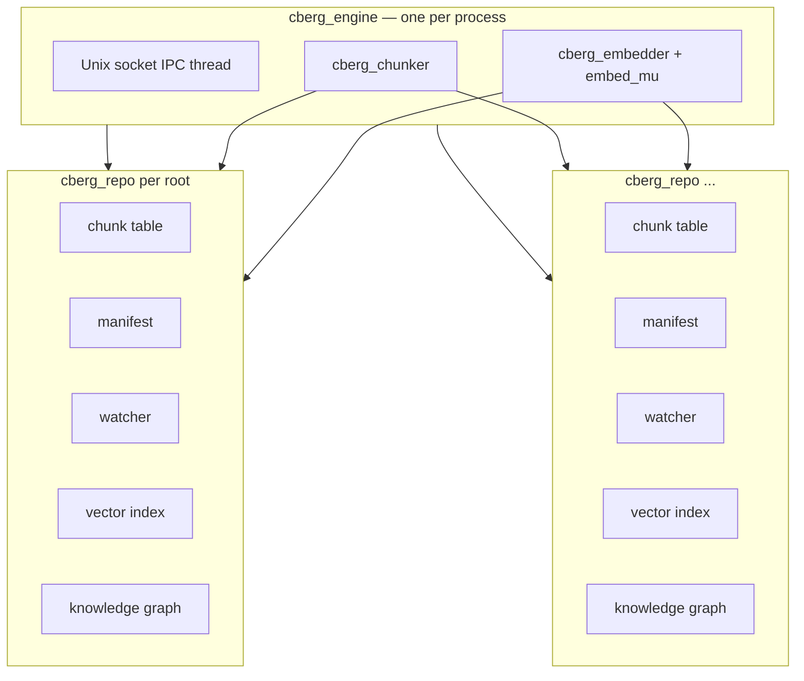

# `cberg-index` — multi-root indexer

The `cberg-index` binary (`core/cmd/cberg-index/`) links `libcodeberg` and runs the
full indexing loop for one or many repository roots in a single process. The Go
`codeberg-d` daemon supervises it and talks to it over a Unix socket — see
[daemon/docs/ipc.md](../../daemon/docs/ipc.md).

**Implementation header:** `core/cmd/cberg-index/indexer.h`  
**Design rationale:** [adr/0004-multi-root-engine.md](adr/0004-multi-root-engine.md)

---

## Environment

| Variable | Required | Purpose |
|----------|----------|---------|
| `CODEBERG_ROOT` | yes¹ | Single repository root (key = basename). `codeberg-d` also accepts a comma-separated list and maps it to `CODEBERG_ROOTS` before spawning this binary — the C indexer itself does not split commas |
| `CODEBERG_ROOTS` | yes¹ | `key\tpath` records, newline-separated (multi-repo; supersedes `CODEBERG_ROOT` when set) |
| `CBERG_MODEL` | for vectors | Path to ONNX `model.onnx` |
| `CBERG_INDEX_PATH` | for vectors | **Base** path for per-repo index files and local sidecars |
| `CBERG_INDEX_BACKEND` | no | `usearch` (default), `qdrant`, or `pgvector` (`postgres` alias) — see [VECTOR_INDEX_PROVIDERS.md](VECTOR_INDEX_PROVIDERS.md) |
| `CBERG_INDEX_QUANT` | no | usearch stored scalar kind: `i8` (default, ~3.5× smaller index) or `f32` (`int8` = `i8`). Applies when an index file is created; existing files keep their saved kind until rebuilt |
| `CBERG_VECTORDB_URL` | for `qdrant` | Qdrant base URL, e.g. `https://cluster.qdrant.io` |
| `CBERG_VECTORDB_API_KEY` | no | Qdrant API key (cloud) |
| `CBERG_POSTGRES_URL` | for `pgvector` | PostgreSQL connection string (pgvector extension required) |
| `CBERG_GRAPH` | no | Knowledge graph kill-switch; default **on**. Set `0` / `off` / `false` to disable |
| `CBERG_GRAPH_MODE` | no | `fast` (syntactic, default). `moderate` / `full` not implemented yet (warn + fall back) |
| `CBERG_SOCKET` | no | Unix socket for IPC (default `/tmp/codeberg-index.sock`) |
| `CBERG_POLL_MS` | no | Watcher idle sleep between steps (default 1000) |
| `CBERG_EMBED_THREADS` | no | ONNX intra-op thread cap (inherited env) |
| `CBERG_EMBED_COREML` | no | Apple Silicon CoreML provider opt-in |

¹ Exactly one of `CODEBERG_ROOT` / `CODEBERG_ROOTS`. Unresolvable roots in
   `CODEBERG_ROOTS` records are skipped with a warning. Comma-separated
   `CODEBERG_ROOT` is a `codeberg-d` convenience only — set `CODEBERG_ROOTS`
   (or let the launcher build it) when talking to `cberg-index` directly.

Without `CBERG_MODEL` the engine runs in **chunk-only mode** (chunk table +
manifest + watcher + optional graph; no vectors). Set `CBERG_INDEX_PATH` even
without a model to persist `.chunks` / `.manifest` / `.graph` for warm restart.

---

## Process architecture



- **One embedder** per process (expensive, not thread-safe) — all `cberg_embedder_embed`
  calls go through `embed_mu`.
- **Per-repo state:** chunk table, manifest baseline, watcher, vector index, knowledge
  graph (when `CBERG_GRAPH` enabled), mutex.
- **Main thread:** bootstrap each repo (including optional graph load / resolve), then
  `cberg_engine_run` (watch loop).
- **IPC thread:** vector search and graph commands; embeds the query once for search,
  then searches each repo's index under that repo's mutex, merges hits by score.

**Lock order:** `repo->mu` → `embed_mu` during indexing; search takes `embed_mu` alone
for query embed, then one `repo->mu` at a time. Never `embed_mu` → `repo->mu`.

---

## Lifecycle

### 1. Open

`cberg_engine_open` reads env, resolves roots, optionally opens ONNX embedder.

### 2. Bootstrap (per repo)

For each `cberg_repo`:

1. Try `cberg_chunk_table_load`, `cberg_manifest_load`, `cberg_index_open` from sidecars.
2. On `NOT_FOUND` or first run → cold walk: parse every file, `sync`, embed all chunks.
3. Open watcher on repo root; mark `ready` when bootstrap completes.

Startup is **sequential** across repos (one bootstrap at a time).

### 3. Watch loop

```
loop until SIGINT/SIGTERM:
    for each repo:
        poll watcher → dirty paths
        re-chunk dirty files → sync → embed added∪modified, remove deleted ids
        (transient vector I/O errors retry up to 3× before full index rebuild)
        save sidecars (chunk table, manifest, index)
    sleep poll_ms when idle
```

### 4. IPC

While the watch loop runs, the IPC thread serves `status`, `search`, and related
requests. Multi-repo search embeds the query once, calls `cberg_search_vector` per
index, merges results.

---

## On-disk artifacts

Given `CBERG_INDEX_PATH=/tmp/codeberg.usearch` and a repo root, paths derive from
a hash of the resolved root (`<index_path> = <base>.<roothash>`):

| File | Contents | Magic |
|------|----------|-------|
| `<index_path>` | usearch HNSW index when `CBERG_INDEX_BACKEND=usearch` | usearch format |
| `<index_path>.chunks` | Serialized chunk table (ids, keys, hashes) — **all backends** | `CBT1` v1 |
| `<index_path>.manifest` | Serialized manifest leaves — **all backends** | `CBMF` v1 |
| `<index_path>.graph` | Knowledge graph snapshot (when `CBERG_GRAPH` enabled) | versioned binary (`binio`) |

Graph schema, confidence ladder, import resolution, IPC, and tools:
[modules/graph.md](modules/graph.md). Design decision:
[adr/0005-dual-index-graph.md](adr/0005-dual-index-graph.md).

With `qdrant` or `pgvector`, vectors live in a remote collection/table named
`codeberg_<16hex>` (derived from `<index_path>`). Chunk sidecars stay local.
Full setup, schemas, and server instructions:
[VECTOR_INDEX_PROVIDERS.md](VECTOR_INDEX_PROVIDERS.md).

Changing `CODEBERG_ROOT` to a different tree produces a different `<roothash>` —
caches never collide. Reverting to a prior root reuses its sidecars for warm start.

`cberg_chunk_table_save` / `load` and `cberg_manifest_save` / `load` use atomic
temp+rename. Incompatible versions return `CBERG_ERR_NOT_FOUND` → cold rebuild.

If the vector index cannot be opened (`CBERG_ERR_IO` — corrupt file, unreachable
remote DB, dimension mismatch), `cberg-index` wipes the index, deletes sidecars,
and cold-reindexes. See [VECTOR_INDEX_PROVIDERS.md](VECTOR_INDEX_PROVIDERS.md#corrupt-index-recovery).

---

## Build and run

```sh
make build-core    # produces core/build/bin/cberg-index
export CODEBERG_ROOT=/path/to/repo
export CBERG_MODEL=models/jina-embeddings-v2-base-code/model.onnx
export CBERG_INDEX_PATH=/tmp/codeberg.usearch
./core/build/bin/cberg-index
```

Normally `codeberg-d` spawns and supervises `cberg-index` — see
[daemon/README.md](../../daemon/README.md).
