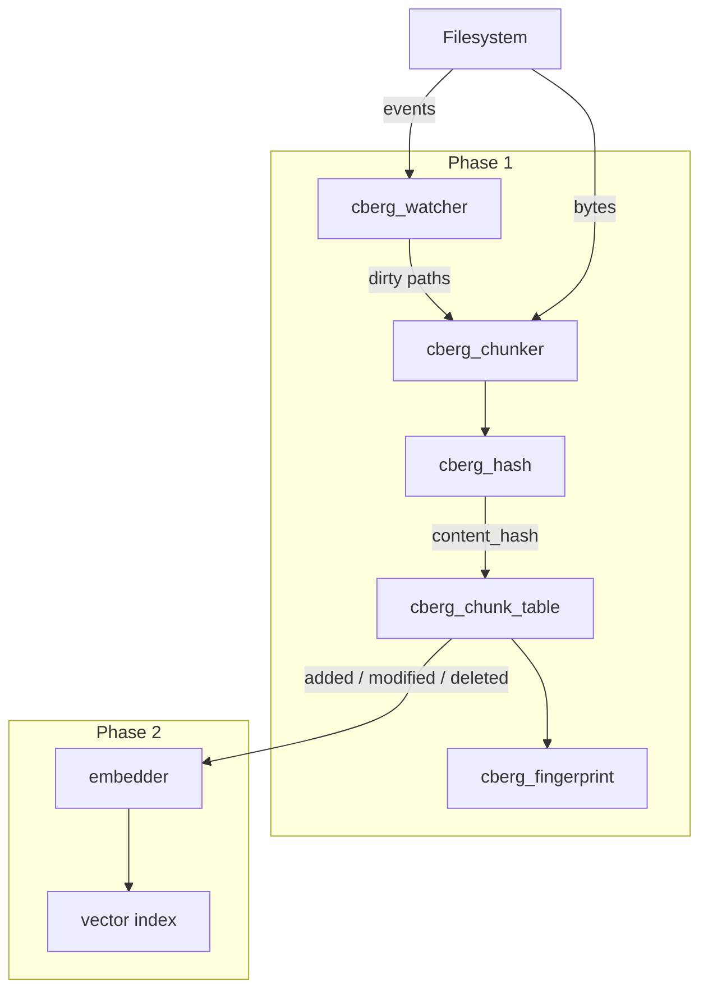

# libcodeberg

`core/` builds **libcodeberg**, a C11 library for codebase indexing: semantic chunks,
incremental change tracking, filesystem watching, ONNX embedding, and vector search.

**Detailed documentation:** [docs/README.md](docs/README.md) — public [API](docs/API.md),
architecture [CORE.md](docs/CORE.md), and per-module [implementation guides](docs/modules/).

---

## Table of contents

1. [What it does](#1-what-it-does)
2. [Design principles](#2-design-principles)
3. [Architecture](#3-architecture)
4. [Public API](#4-public-api)
5. [Chunking](#5-chunking)
6. [Change tracking](#6-change-tracking)
7. [Hashing and fingerprints](#7-hashing-and-fingerprints)
8. [Filesystem watching](#8-filesystem-watching)
9. [End-to-end flows](#9-end-to-end-flows)
10. [Source layout](#10-source-layout)
11. [Build and dependencies](#11-build-and-dependencies)
12. [Testing](#12-testing)
13. [Threading and ownership](#13-threading-and-ownership)
14. [Embedding and search](#14-embedding-and-search)

For **per-function API detail** see [API.md](API.md). For **every internal function**
see [modules/](modules/).

---

## 1. What it does

| Step | Component | Output |
|------|-----------|--------|
| Parse | `cberg_chunker` | Logical units of code (functions, methods, types, …) with stable keys |
| Hash | `cberg_hash` | XXH3-128 digest of each chunk’s source bytes (zero-padded to 32 bytes) |
| Diff | `cberg_chunk_table` | Added, modified, and deleted chunks since the last pass |
| Summarize | `cberg_fingerprint` | Single digest over the whole chunk set |
| Watch | `cberg_watcher` | Repo-relative paths that changed on disk |

The diff is the contract for downstream work: only **added** and **modified** chunks
need embedding; **deleted** chunks need purging from the vector index (phase 2).

---

## 2. Design principles

### Speed on the hot path

Indexing touches every file in a tree, often repeatedly during development. The library
optimizes for that workload:

- **Warm tree-sitter state** — parsers and queries are created once per language and
  reused across files (`cberg_chunker`).
- **Bump allocation** — chunk lists allocate keys and symbols from an arena instead
  of many small `malloc` calls.
- **O(1) key lookup** — the chunk table indexes keys in an FNV-1a hash map during
  sync.
- **One-pass set digest** — `cberg_fingerprint` sorts keys once and streams them
  through a second XXH3-128 pass over `(key, content_hash)` pairs.

### Correct incremental updates

A chunk is identified by **what** it is (path, kind, symbol), not by **where** its
bytes currently sit in the file. Keys stay stable when body text changes; only the
content hash updates. Chunk **ids** (`uint64_t`) are assigned at first insert and
reused on modify so vector index entries never need re-keying.

### Watcher-driven indexing

Incremental work is triggered **only** by `cberg_watcher`. The core has no cron, no
periodic full-tree scan, and no commit-hash polling. A process opens a watcher on the
repo root and blocks in `cberg_watcher_poll`; dirty paths drive re-chunking.

A **one-time full walk** at startup bootstraps the chunk table when no events have
arrived yet. It is not a recurring schedule.

An optional **daemon** may run scheduled `git pull` to refresh a mirror. That writes
files to disk; the watcher sees the same events as a local save. The daemon must not
invoke chunk/sync on a timer — see
[adr/0002-watcher-driven-indexing.md](adr/0002-watcher-driven-indexing.md).

### Watcher selects files; diff selects chunks

The watcher names **which files** to re-read. `cberg_chunk_table_sync` is still
**authoritative** for which chunks were added, modified, or deleted — coalesced events,
rename edge cases, and edits that leave a file’s mtime unchanged but change chunk
boundaries all land here.

### Narrow ABI

`include/codeberg/codeberg.h` is the only public header. Tree-sitter, xxHash, and
future ONNX/usearch symbols stay inside the library. Opaque handles (`cberg_chunker`,
`cberg_chunk_table`, `cberg_watcher`) hide layout and allow internal changes.

---

## 3. Architecture



Two hash roles serve different questions:

| Mechanism | API | Answers |
|-----------|-----|---------|
| Per-chunk content hash | `cberg_hash` + `sync` | Which chunks were added, changed, or removed? |
| Set fingerprint | `cberg_fingerprint` | Did the indexed set as a whole change? |

The fingerprint is recomputed after every successful `sync` and stored on the table.

---

## 4. Public API

Header: `core/include/codeberg/codeberg.h`.

### Status

```c
typedef enum cberg_status {
    CBERG_OK = 0,
    CBERG_ERR_INVALID_ARGUMENT,
    CBERG_ERR_INTERNAL,
    CBERG_ERR_IO,
    CBERG_ERR_UNSUPPORTED_LANGUAGE,
    CBERG_ERR_NOT_FOUND,
    CBERG_ERR_OUT_OF_MEMORY,
    CBERG_ERR_TIMEOUT,
} cberg_status;

const char *cberg_status_str(cberg_status);
const char *cberg_version(void);
```

Fallible functions return `cberg_status`. Out-parameters are valid only on `CBERG_OK`.
`free` / `close` on `NULL` is a no-op.

### Modules

| Handle | Key functions | Source | Detail |
|--------|---------------|--------|--------|
| `cberg_chunker` | `open`, `close`, `parse` | `chunk/chunker.c` | [chunk.md](modules/chunk.md) |
| `cberg_chunk_list` | `len`, `at`, `free`, `hash_bodies` | `chunk/chunker.c` | [chunk.md](modules/chunk.md) |
| `cberg_chunk_table` | `new`, `free`, `sync`, `len`, `fingerprint` | `chunk/chunk_table.c` | [chunk.md](modules/chunk.md) |
| `cberg_watcher` | `open`, `close`, `poll`, `dirty_paths` | `watch/watch.c` | [watch.md](modules/watch.md) |
| `cberg_embedder` | `open`, `embed`, `close` | `embed/embed.c` | [embed.md](modules/embed.md) |
| `cberg_index` | `open`, `add`, `remove`, `search`, `save` | `search/index.c` | [search.md](modules/search.md) |
| — | `cberg_search_query` | `search/search.c` | [search.md](modules/search.md) |
| — | `cberg_config_*` (`CODEBERG_ROOT`) | `common/config.c` | [common.md](modules/common.md) |
| — | `cberg_hash`, `cberg_fingerprint` | `common/hash.c` | [common.md](modules/common.md) |
| — | `cberg_language_from_path` | `common/lang.c` | [common.md](modules/common.md) |

Full signatures and return codes: [API.md](API.md).

`CBERG_HASH_LEN` is 32 bytes.

---

## 5. Chunking

### Language detection

`cberg_language_from_path` maps extensions to a `cberg_language` enum:

| Extensions | Language |
|------------|----------|
| `.go` | Go |
| `.ts`, `.tsx` | TypeScript |
| `.js`, `.jsx`, `.mjs`, `.cjs` | JavaScript |
| `.c`, `.h` | C |
| `.kt`, `.kts` | Kotlin |
| `.py`, `.pyi` | Python |
| `.java` | Java |
| other | `CBERG_LANG_UNKNOWN` |

### Tree-sitter

Seven grammars live under `third_party/grammars/`. Each language has a query in
`chunker.c` with captures:

- `@function`, `@method`, `@class`, `@struct`, `@interface` → `cberg_chunk_kind`
- `@name` → symbol string

`cberg_chunker` holds one `TSParser` + `TSQuery` per language slot. Open one chunker
per worker thread and reuse it for every file in that thread.

**Why tree-sitter:** incremental, error-tolerant parsing at editor speed; queries
select AST nodes declaratively without hand-written walkers per language.

### Window fallback

Files with no grammar match are split into **50-line windows** (`CBERG_WINDOW_LINES`).
Kind is `CBERG_CHUNK_WINDOW`; symbol is `NULL`. This keeps prose, config, and
generated blobs searchable at reasonable granularity.

### Stable keys

```
ident = "<relpath>::<kind>::<symbol>"
key   = "<ident>#<n>"
```

- `kind` — integer enum value.
- `symbol` — empty for window chunks.
- `n` — disambiguates repeated idents in one file (overload sets, duplicate names).

Example: `auth/jwt.go::1::ValidateJWT#0`

Spans (`cberg_span`) record byte offsets into the source buffer and 1-based inclusive
line numbers.

### Example

```c
cberg_chunker *ch;
cberg_chunker_open(&ch);

cberg_chunk_list *list;
cberg_chunker_parse(ch, CBERG_LANG_GO, "auth/jwt.go", src, src_len, &list);
cberg_chunk_list_hash_bodies(list, src, src_len);

for (size_t i = 0; i < cberg_chunk_list_len(list); i++) {
    const cberg_chunk *c = cberg_chunk_list_at(list, i);
    /* c->key, c->content_hash, c->span */
}

cberg_chunk_list_free(list);
cberg_chunker_close(ch);
```

---

## 6. Change tracking

`cberg_chunk_table` holds every chunk for one indexed tree in memory.

### Stable ids

Each row gets a `uint64_t id` at insert. Modifications update `content_hash` and
metadata but keep the same `id`. Deletions free the row and return the id in
`changes.deleted` so the vector index can remove the matching vector.

**Why stable ids:** HNSW keys and on-disk cache filenames should not churn when a
developer edits a function body.

### Sync

`cberg_chunk_table_sync(table, incoming, count, &changes)`:

```
pre_len = table.len at entry
allocate seen[0 .. pre_len)

for each incoming chunk:
    if key ∉ map:
        insert → changes.added, new id
    else:
        seen[index] = true
        if content_hash changed:
            update row → changes.modified

for i in 0 .. pre_len:
    if not seen[i]:
        remove row → changes.deleted

recompute fingerprint
```

The `pre_len` bound ensures rows inserted during this pass are not treated as
deletions in the same call.

### Change output

```c
typedef struct cberg_changes {
    cberg_stored_chunk *added;
    size_t added_len;
    cberg_stored_chunk *modified;
    size_t modified_len;
    cberg_stored_chunk *deleted;
    size_t deleted_len;
} cberg_changes;
```

Pointers are valid until the next `sync` or `free` on the table. Deleted entries are
sorted by `id` for deterministic purge order.

### Persistence

Phase 1 is in-memory only. A future persistence layer will snapshot the same key → id
→ hash mapping without changing the sync contract.

---

## 7. Hashing and fingerprints

### Content digest — `cberg_hash`

XXH3-128 over the exact chunk byte range (`hash.c`, vendored `xxhash.c`). The 16-byte
digest is zero-padded to `CBERG_HASH_LEN` (32).

Used in `sync` to detect modifications. Unchanged digest + unchanged key → row left
untouched → no re-embedding.

**Why XXH3-128:** fast on small/medium blobs; accidental collision risk is negligible
at repo scale. A false “unchanged” would skip re-embedding stale vectors — 128 bits is
more than sufficient for that detector role.

### Set fingerprint — `cberg_fingerprint`

1. Pair each `(key, content_hash)`.
2. Sort pairs by `key` (order-independent result).
3. Stream `key || 0x00 || content_hash` into a separate XXH3-128 pass (`xxhash.c`).
4. Write 16 digest bytes, zero-pad to `CBERG_HASH_LEN`.

Empty input → all-zero output.

**Why a second XXH3 pass:** order-independent rollup over the whole set in one
streaming digest after a single sort. Per-chunk and set-level digests use the same
algorithm but different inputs (raw bytes vs. sorted key/hash pairs).

| Question | Use |
|----------|-----|
| Which chunks changed? | `cberg_chunk_table_sync` |
| Did the whole set change? | `cberg_chunk_table_fingerprint` before/after |
| Did these bytes change? | `cberg_hash` on the body |

---

## 8. Filesystem watching

`cberg_watcher` registers a recursive watch on a repository root and collects
debounced dirty paths (repo-relative).

### Skipped directories

`pathutil.c` never descends into:

`.git`, `node_modules`, `vendor`, `.venv`, `__pycache__`, `.next`, `dist`, `build`,
`target`, `.gradle`, `.idea`, `.terraform`

### Backends

| Platform | Mechanism | Behavior |
|----------|-----------|----------|
| macOS | FSEvents with `FileEvents` + `WatchRoot` | File-level paths; 75 ms latency (`CBERG_WATCH_DEBOUNCE_MS`); dispatch queue |
| Linux | `inotify` on each directory | New subdirectories registered on `IN_CREATE` |
| Other | mtime polling | Full-tree stat scan; higher latency, always available |

On macOS the watch root is `realpath`’d at open so event paths and the configured root
share the same canonical prefix.

### Example

```c
cberg_watcher *w;
cberg_watcher_open("/path/to/repo", &w);

cberg_watch_event events[64];
size_t n = 0;
cberg_watcher_poll(w, events, 64, &n, 500);

for (size_t i = 0; i < n; i++) {
    /* re-chunk events[i].path */
    free((void *)events[i].path);
}

cberg_watcher_close(w);
```

`cberg_watcher_dirty_paths` drains the internal set and transfers path pointers to the
caller.

---

## 9. End-to-end flows

### Bootstrap (once at startup)

Before the watcher has fired, run a single full walk to populate the chunk table:

```
chunker, table, watcher ← open
for each file under root:
    read → parse → hash_bodies → append to incoming[]
sync(table, incoming) → changes
→ (phase 2) embed added ∪ modified
```

Then enter the watch loop. Do not repeat the full walk on a schedule.

### Watch loop (primary)

```
loop:
    poll watcher → dirty paths
    for each dirty path:
        read → parse → hash_bodies
        merge into incoming[] for this sync
    sync(table, incoming) → changes
    → (phase 2) embed added ∪ modified, purge deleted ids
```

This is the only ongoing indexing driver. After a daemon `git pull`, files change on
disk and the watcher delivers the same dirty paths as a local edit.

---

## 10. Source layout

```
core/
├── include/codeberg/codeberg.h
├── src/
│   ├── common/           arena, hash, lang, pathutil, status, version
│   ├── chunk/            chunker, chunk_table
│   ├── watch/            filesystem watcher
│   ├── embed/            ONNX embedder + tokenizer
│   └── search/           usearch index + semantic search
├── third_party/
│   ├── tree-sitter/
│   ├── grammars/         seven language parsers
│   ├── usearch/
│   ├── onnxruntime-extensions/
│   └── xxhash.c
├── test/
├── CMakeLists.txt
└── libcodeberg.pc.in
```

Headers under `src/*/` are internal to each module.

---

## 11. Build and dependencies

### Prerequisites

- C11 compiler (Clang or GCC)
- CMake ≥ 3.20
- Git submodules (tree-sitter + grammars; see `.gitmodules`)

### Build

```sh
git submodule update --init --recursive
make build
make test
```

| Output | Path |
|--------|------|
| Static lib | `core/build/libcodeberg.a` |
| Shared lib | `core/build/libcodeberg.so` / `.dylib` |
| pkg-config | `core/build/libcodeberg.pc` |

### Third-party code linked in

| Component | Role |
|-----------|------|
| tree-sitter runtime | Parser engine |
| Language grammars (×7) | Go, C, Java, JS, Python, Kotlin, TypeScript |
| xxHash | Per-chunk content digests and set fingerprint |
| CoreServices (macOS) | FSEvents |

Phase 2 adds ONNX Runtime and usearch the same way — compiled into the library,
not exposed in the public header.

---

## 12. Testing

`core/test/` — CTest binaries:

| Test | Covers |
|------|--------|
| `test_smoke` | Version string |
| `test_chunker` | Extension detection, Go symbols, window fallback |
| `test_chunk_table` | Cold sync, modify one hash, delete all |
| `test_fingerprint` | Order independence, sensitivity, empty set |
| `test_watch` | File modify detected under temp directory |

```sh
cd core/build && ctest --output-on-failure
```

---

## 13. Threading and ownership

| Object | Concurrency | Lifetime |
|--------|-------------|----------|
| `cberg_chunker` | One per thread | `open` / `close` |
| `cberg_chunk_list` | Caller owns after `parse` | `chunk_list_free` |
| `cberg_chunk_table` | Single-threaded | `new` / `free` |
| `cberg_changes` | Until next `sync` on same table | do not free members |
| `cberg_watcher` | Single consumer | `open` / `close` |
| `events[i].path` | Caller `free`s after `poll` | transferred from watcher |

---

## 14. Embedding and search

Implemented in the same `codeberg.h` ABI. **Full API:** [API.md](API.md#embedding).
**Implementation:** [modules/embed.md](modules/embed.md), [modules/search.md](modules/search.md).

| Module | Purpose |
|--------|---------|
| `cberg_embedder` | ONNX Runtime — chunk text → L2-normalized float vectors (jina-embeddings-v2-base-code, 768-dim) |
| `cberg_index` | usearch HNSW — add / remove / search by chunk `id`; tunable connectivity and expansion factors |
| `cberg_search_query` | Embed a query string with adaptive `expansion_search` (higher ef for better recall) |
| `cberg-index` CLI | C binary — bootstrap walk, then watcher loop → chunk → sync → embed → index |
| Persistence | Index snapshots via `cberg_index_save`; chunk table persistence still optional |

HNSW defaults: `connectivity=16`, `expansion_add=128`, `expansion_search=64`. `cberg_search_query` raises ef to `max(min_ef, k * oversample)` per query (defaults: min 64, oversample 4). ONNX embed batches up to 8 texts per inference when possible.

Embedding runs only on `changes.added` and `changes.modified`; `changes.deleted` removes vectors by `id`.
