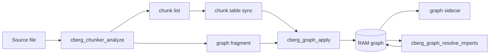

# Module: `src/graph/`

RAM-first **knowledge graph** beside the chunk/vector index
([ADR 0005](../adr/0005-dual-index-graph.md)). The same tree-sitter parse that
produces chunks also emits a per-file graph fragment; `cberg-index` applies
fragments incrementally and persists a `.graph` sidecar.

**Files**

| File | Role |
|------|------|
| `graph_store.c` | In-memory store, query, trace, hubs, save/load, import rewrite helper |
| `graph_extract.c` | Per-language tree-sitter reference queries → fragment |
| `resolve_pkg.c` | Phase 2: manifest + path heuristics → rewrite IMPORTS to FILE |
| `graph_internal.h` | Fragment / extractor / rewrite internals |

**Depends on:** `common/arena`, `common/binio`, `common/strmap`, `common/u64map`,
`common/hash`, `common/fileio`, `common/pathutil`, walk policy, tree-sitter
(via chunker).

Public ABI: `cberg_graph_*` and `cberg_chunker_analyze` in
[../API.md](../API.md) / `codeberg.h`.

---

## Pipeline

1. **Extract** — one parse; symbol chunks become fragment defs; queries capture
   calls / imports / inherits / membership.
2. **Apply** — replace that file’s subgraph; resolve def keys → chunk ids.
3. **Resolve imports** (after bootstrap / rebuild) — rewrite safe IMPORTS onto
   FILE nodes with `resolution=import`.
4. **Query** — `find_nodes`, `edges_from` / `edges_to`, `trace`, `hubs`.
5. **Persist** — atomic dump; warm restart loads without re-embedding.

---

## Schema

### Nodes (`cberg_graph_node`)

| Kind | Id space | `name` / `qname` / `path` |
|------|----------|---------------------------|
| `FILE` | synthetic (top bit set) | basename / repo-relative path / path |
| `FUNCTION` / `METHOD` / `CLASS` / `STRUCT` / `INTERFACE` | **stable chunk id** | symbol / chunk key / defining file |
| `MODULE` | synthetic | import string / same / `NULL` |

Symbol nodes reuse chunk ids via `cberg_chunk_table_find_by_key` at apply time,
so graph, chunk table, and vectors stay aligned across edits.

### Edges (`cberg_graph_edge`)

| Kind | Meaning | Stored? |
|------|---------|---------|
| `DEFINES` | File → symbol | **Synthesized** at query time from live nodes |
| `CONTAINS` | Type → member (span nesting; Go receiver / Rust impl reversed) | yes (as refs) |
| `IMPORTS` | File → Module (or File → File after resolve) | yes |
| `CALLS` | caller → callee (name-resolved at query time) | yes (name refs) |
| `INHERITS` | subtype → supertype | yes (name refs) |
| `REFERENCES` | reserved | yes |

Every resolved edge carries:

- `resolution` — `textual` (name match), `import` (manifest/path rewrite), later `typed`
- `confidence` — see ladder below
- `line` — reference site in the source file (0 if unknown)

### Query-time name resolution

Call/inherit references store a **name**, not a hard id. `edges_from` /
`edges_to` / `trace` resolve names against the live definition index, so
deleting a file can never leave a dangling edge.

## Confidence ladder (textual)

| Case | Confidence |
|------|------------|
| Exact / pre-resolved (same-file CONTAINS, DEFINES, etc.) | `1.0` |
| Same-file name match | `0.90` |
| Unique cross-file match | `0.75` |
| Ambiguous (`n` candidates) | `0.75 · min(1, 3/n)` |
| Import-resolved FILE target | `0.95` |
| Fan-out cap | at most **8** candidates per reference |

Agents must treat `resolution=textual` as a hint, not go-to-definition.

---

## Extraction (`graph_extract.c`)

`cberg_chunker_analyze` runs one parse and returns chunks + an optional
`cberg_graph_fragment`. Languages without tree-sitter (markdown, YAML/TOML/JSON,
unknown) yield a `NULL` fragment.

Reference queries cover nine grammar languages: Go, C, Python, TypeScript,
JavaScript, Java, Kotlin, Rust, Ruby — calls, imports, inheritance, plus Go
receiver / Rust impl membership as reversed `CONTAINS`. Ruby
`require` / `require_relative` become `IMPORTS`. `CONTAINS` among same-file
symbols also comes from chunk span nesting.

Capture vocabulary:

| Capture | Meaning |
|---------|---------|
| `@call` | Callee identifier at a call site |
| `@import` | Import path / module string (quotes stripped) |
| `@inherit` | Supertype / implemented interface name |
| `@member.container` + `@member.name` | Out-of-body membership → reversed CONTAINS |
| `@require.method` + `@require.path` | Ruby require → IMPORTS |

---

## Persistence

Binary sidecar next to the chunk table:

| Artifact | Magic / version | Contract |
|----------|-----------------|----------|
| `<index_path>.graph` | versioned binary via shared `binio.h` | atomic temp+rename; absent or incompatible → `CBERG_ERR_NOT_FOUND` → rebuild from source |

Same layout as `.chunks` / `.manifest` under `CBERG_INDEX_PATH.<roothash>`.
When `CBERG_INDEX_PATH` is set **without** `CBERG_MODEL`, sidecars (including
`.graph`) are still written so chunk-only warm restart can reload the graph.

On compaction, MODULE nodes with no live IMPORTS importers are dropped
(orphan GC). Tombstoned refs from import rewrites are compacted when dead
entries dominate.

---

## Indexer env

| Variable | Default | Purpose |
|----------|---------|---------|
| `CBERG_GRAPH` | on | Kill-switch: `0` / `off` / `false` disables graph |
| `CBERG_GRAPH_MODE` | `fast` | Only `fast` (syntactic) implemented; other values warn and fall back |
| `CBERG_INDEX_PATH` | — | Base path for `.chunks` / `.manifest` / `.graph` (and vectors when model set) |

Graph failures log a warning and never block the chunk/vector pipeline.

---

## Incremental semantics

1. Dirty path → `cberg_chunker_analyze` → chunk-table sync → `cberg_graph_apply`
   (replace that file’s subgraph).
2. Deleted path → `cberg_graph_remove_file` (nodes + refs for that path).
3. After cold/warm bootstrap and full rebuilds → `cberg_graph_resolve_imports`.
4. Warm restart → load `.graph`, or re-extract from source without re-embedding
   when the sidecar is missing/stale.

---

## Import resolution (`resolve_pkg.c`)

`cberg_graph_resolve_imports(graph, repo_root)` walks the repo for source files,
reads `go.mod` / `package.json` / `pyproject.toml` / `Cargo.toml` (when present),
and rewrites **MODULE**-targeting IMPORTS onto FILE nodes with
`resolution=import` (confidence 0.95).

**Candidates (safe shapes only):**

| Shape | Example | Notes |
|-------|---------|-------|
| Relative | `./helper`, `../lib/x` | Always eligible |
| Rust path | `crate::helper` | `::` present |
| Go module-prefixed | `example.com/app/pkg` | Must match `go.mod` module path |
| Multi-segment dotted | `pkg.sub.mod` | Python-style |
| Source-file path | `foo/bar.h` | Extension must look like source |

**Never rewritten:** bare identifiers (`fmt`, `json`, `os`) and slash-form
stdlib / npm packages (`encoding/json`, `react-dom/client`) unless they match
a Go module prefix. Package/crate `name` fields are **not** mapped onto the
first source file.

Already-resolved FILE imports are left alone (idempotent). Unresolved imports
keep their MODULE target. FILE enumeration uses the live graph size (no fixed
cap). Tests: `core/test/test_graph_resolve.c`.

`cberg_graph_hubs` ranks symbols by full incident `CALLS` degree (in+out,
uncapped) for architecture overviews (IPC `graph_hubs`).

---

## IPC / tools

`cberg-index` commands (see [daemon/docs/ipc.md](../../../daemon/docs/ipc.md)):

| Command | Role |
|---------|------|
| `search_graph` | Exact-name node search |
| `trace_path` | BFS over edge kinds / directions; optional `path_prefix` (exact path preferred) |
| `graph_stats` | Node/ref counts + FILE language mix by extension |
| `graph_hubs` | CALLS degree hubs |
| `graph_refs` | Incoming edges for `find_references` |

Disabled graph → error string `graph disabled` (`NOT_IMPLEMENTED` / HTTP 501).

Daemon tools ([daemon/docs/http.md](../../../daemon/docs/http.md)):

| Tool | Behavior |
|------|----------|
| `search_graph` / `trace_path` | Thin wrappers over IPC |
| `detect_changes` | Git diff → hunk-overlapping symbols → 1–2 hop blast radius; sets `fallback` / `diff_spec` when the requested range fails |
| `get_architecture` | Stats + language mix + real hubs + entrypoint heuristics; surfaces hub errors |
| `find_references` | Graph-first; returns `{source, graph\|matches}` (not a bare array); grep fallback |

Agent policy: **meaning → search; structure → graph; exact string → grep**.

---

## Self-index timing (this repo)

Chunk-only cold index of the Codeberg tree with graph enabled (no ONNX), measured
on the cloud agent VM (2026-07-09). Wall-clock is `cberg-index` bootstrap until
ready; warm restart loads the `.graph` sidecar (no re-embed).

| Run | Wall time | Scale |
|-----|-----------|-------|
| Cold graph build | **~87 s** | ~251k chunks, ~19.6k nodes, ~82.6k refs (includes vendored `third_party/` grammars) |
| Warm restart (load `.graph`) | **~0.73 s** | same sidecars; `warm restart: 0 added/modified/deleted` |

`search_graph` / `trace_path` on `cberg_chunker_parse` returned plausible callers
(e.g. `test_chunker.c` fixtures) with `resolution=textual`. Average application
repos without vendored grammar trees should land closer to the “seconds”
structural-path target; this tree is an outlier because of `core/third_party/`.

Microbenchmarks: [bench_graph](../../bench/bench_graph.c) (apply/remove churn,
`edges_to` hub, BFS trace, save/load).

---

## Tests

| Binary | Coverage |
|--------|----------|
| `test_graph` | Apply / query / trace / confidence / persistence |
| `test_graph_extract` | Per-language captures (incl. Ruby require) |
| `test_graph_resolve` | Stdlib non-rewrite, slash-stdlib decoy, Go module path, TS relative, Rust `crate::` |
| `test_cberg_engine` | IPC round-trips for graph commands |

Daemon: `graphtools_test.go`, `indextools_test.go` (find_references shape).

---

## Known limitations

- Kotlin extension/infix call shapes are incomplete in `fast` mode.
- Rust: trait-impl `INHERITS` (`impl Trait for Type`) deferred to typed mode.
- Symbol `qname` is the chunk key, not a package-qualified name (improves as
  import resolution maps packages → files).
- Hybrid LSP / `CBERG_GRAPH_MODE=moderate|full` not implemented yet (env warns
  and falls back to `fast`).
- Self-index cold time on this monorepo is dominated by vendored grammar trees
  under `core/third_party/` (~250k chunks); application repos should be much
  smaller.
- Module orphans are dropped on compaction when they have no live IMPORTS.
