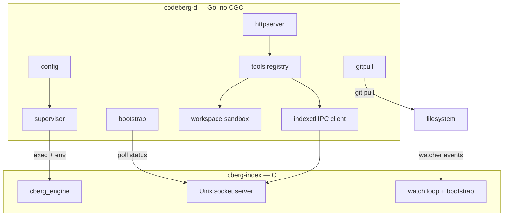

# Daemon architecture

How `codeberg-d` (Go) supervises `cberg-index` (C) and serves the HTTP agent API.

**Related docs:** [http.md](http.md) (agent-facing API), [ipc.md](ipc.md) (indexer wire protocol),
[multi-repo.md](../../docs/multi-repo.md) (multi-root config).

---

## Components



| Package | Role |
|---------|------|
| `cmd/codeberg-d` | Wiring: config → supervisor → bootstrap → HTTP + git pull |
| `internal/config` | `CODEBERG_ROOT` / `CODEBERG_ROOTS`, git pull dirs, socket path |
| `internal/supervisor` | Spawn, restart, and stop `cberg-index` |
| `internal/bootstrap` | Block until indexer reports `ready` (timeout scales with repo count) |
| `internal/indexctl` | Unix socket client — status, search, tool proxies |
| `internal/httpserver` | `/health`, `/search`, `/tools`, `/tools/call` |
| `internal/tools` | Agent tool registry (grep, search, hybrid_search, …) |
| `internal/workspace` | Path sandboxing, multi-repo resolution, limits |
| `internal/search` | Hybrid vector + lexical reranking |
| `internal/subprocess` | Safe `pipe` tool — allowlisted commands, no shell |
| `internal/gitpull` | Periodic `git pull --ff-only` per served root |
| `internal/git` | `git` subprocess helper |

Indexer implementation: `core/cmd/cberg-index/` — see
[core/docs/CBERG_INDEX.md](../../core/docs/CBERG_INDEX.md).

---

## Startup sequence

1. **Load config** from environment (`config.LoadDaemon`).
2. **Start supervisor** — exec `cberg-index` with forwarded env:
   `CODEBERG_ROOT` or `CODEBERG_ROOTS`, `CBERG_SOCKET`, `CBERG_POLL_MS`,
   optional `CBERG_MODEL`, `CBERG_INDEX_PATH`. Other env (e.g. `CBERG_EMBED_THREADS`)
   is inherited from the daemon process.
3. **Wait for ready** — `bootstrap.WaitIndexer` polls IPC `status` every 200 ms until
   `ready: true` or timeout (`5 min × repo count`, max 60 min).
4. **Start git pull** (optional) — background goroutine when
   `CODEBERG_GIT_PULL_INTERVAL_SEC > 0`.
5. **Listen HTTP** — default port 8080 (`CODEBERG_HTTP_PORT`).

Failure at steps 1–3 is fatal (`log.Fatal`). The supervisor alone keeps restarting
a crashed indexer with exponential backoff (1 s → 30 s cap).

---

## Shutdown sequence

On `SIGTERM` / `SIGINT`:

1. HTTP server graceful shutdown (5 s drain).
2. Supervisor sends `SIGINT` to `cberg-index`.
3. Process exits.

---

## Operating modes

| Mode | Env | Vector search | Chunk tools |
|------|-----|---------------|-------------|
| Chunk-only | No `CBERG_MODEL` / `CBERG_INDEX_PATH` | `501 NOT_IMPLEMENTED` | `find_symbol`, `file_outline`, `get_chunk`, grep, … |
| Full | Both set | `GET /search`, `search`, `hybrid_search` | All tools |

`GET /health` exposes `vectors_enabled` and per-repo `ready` / `chunks`.

---

## Multi-repo

When `CODEBERG_ROOTS` lists several repos (or a single root without a default key),
`cberg-index` runs one engine with per-repo state. The daemon:

- Resolves `repo` on every tool and search request via `workspace.resolveKey`.
- Merges vector search hits across repos by score when `repo` is omitted.
- Sandboxes each tool call to **one** repo root — never crosses repo boundaries.

See [multi-repo.md](../../docs/multi-repo.md).

---

## Security model (summary)

- **Workspace sandbox:** relative paths only; `..` and absolute paths rejected;
  symlinks resolved and must stay under repo root (`403 FORBIDDEN` on escape).
- **Pipe tool:** no shell; allowlisted commands only; denied write/exec flags.
- **Limits:** grep 200 matches, glob 500 files, read_file 64 KiB content, pipe 256 KiB
  stdout, 15 s subprocess timeout — see [http.md](http.md).

---

## Testing

```sh
make daemon-test   # go test ./... in daemon/
```

Mock Unix socket tests in `internal/indexctl/client_test.go` and HTTP integration
in `internal/httpserver/server_test.go`. No full supervisor + real `cberg-index`
integration test in Go — use manual `make run-daemon` for end-to-end checks.
