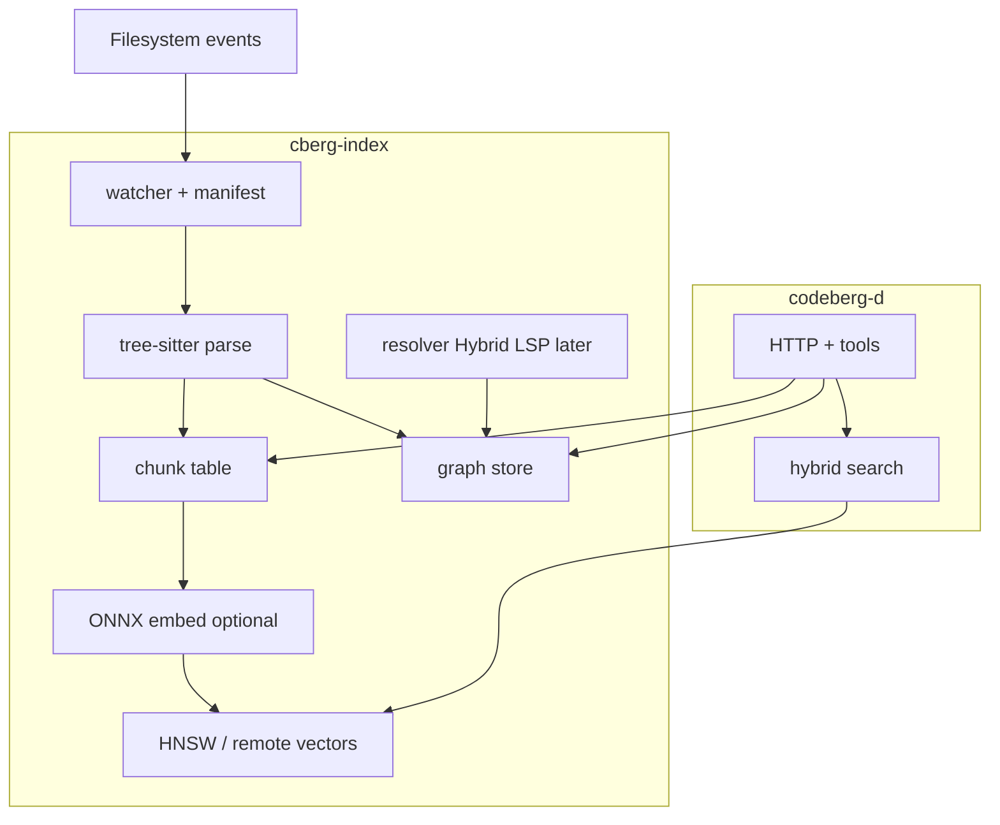

# Full intelligence backend — plan

Status: **draft / proposed.** Goal: evolve Codeberg from a chunk + vector
retrieval stack into a **full code-intelligence backend** — semantic search,
structural knowledge graph, and agent tools — without throwing away what already
works.

Reference system: [DeusData/codebase-memory-mcp](https://github.com/DeusData/codebase-memory-mcp)
(MIT). We borrow **designs, data-model ideas, and selective algorithms**, not a
wholesale port. Keep Codeberg’s C-core / Go-daemon / TS-agent split and
watcher-driven incremental indexing ([ADR 0001](../core/docs/adr/0001-standalone-c-core.md),
[ADR 0002](../core/docs/adr/0002-watcher-driven-indexing.md)).

Related: [agent-accuracy.md](agent-accuracy.md) (retrieval quality),
[ADR 0005](../core/docs/adr/0005-dual-index-graph.md) (dual-index decision).

---

## 1. North star

An agent (ours or any MCP client) should be able to answer, with evidence:

| Question class | Today | Target |
|----------------|-------|--------|
| “Where is auth middleware?” | Vector / hybrid search | Same, stronger fusion + full-chunk context |
| “Who calls `cberg_chunker_parse`?” | Grep (`find_references`) | Graph `trace_path` with confidence |
| “What breaks if I change this?” | Manual | `detect_changes` over git diff + call graph |
| “How is this repo structured?” | Ad-hoc reads | `get_architecture` from graph |
| “Find similar / clone code” | Cosine neighbors only | `SIMILAR_TO` + vector neighbors |

**Product shape:** dual index in one `cberg-index` process —

1. **Chunk + vector index** (existing) — agentic semantic retrieval  
2. **Knowledge graph** (new) — structural intelligence  

Both fed from the **same tree-sitter parse pass**, updated by the **same watcher
+ manifest diff**, keyed by the **same stable chunk ids**.

---

## 2. What we keep (Codeberg strengths)

Do **not** re-engineer these:

| Keep | Why |
|------|-----|
| C hot path in `libcodeberg` | ADR 0001 — parsers, tensors, index pages in one process |
| Stable chunk keys + `uint64` ids | Graph nodes and vector keys stay aligned across edits |
| Content-hash chunk sync | Incremental re-embed / re-edge only on real body changes |
| Watcher-driven indexing | ADR 0002 — no cron full rescans |
| Merkle manifest | Warm restart + many-repo scale (ADR 0003) |
| Multi-root engine | One embedder, per-root state (ADR 0004) |
| Optional ONNX / chunk-only modes | Graph must work without embeddings |
| Go daemon tool sandbox + TS agent | HTTP tools, hybrid search, agent loop |
| Existing agent-accuracy roadmap | Bigger snippets, RRF fusion, eval harness |

---

## 3. What to borrow from codebase-memory-mcp

MIT-licensed — attribute in `THIRD_PARTY` / NOTICE when we copy code or
substantial algorithms. Prefer **porting ideas into our ABI** over vendoring
their whole `src/` tree (different process model, SQLite-centric, MCP-stdio).

### 3.1 Borrow early (high leverage, fits our stack)

| Idea | Their module | Codeberg landing zone |
|------|--------------|------------------------|
| Multi-pass pipeline: structure → definitions → calls → links | `src/pipeline/` | `core/src/graph/` extractors after `cberg_chunker_parse` |
| Node / edge labels (`Function`, `Class`, `CALLS`, `IMPORTS`, …) | Graph data model in README | `cberg_graph_*` types in `codeberg.h` |
| RAM-first build + single dump | in-memory SQLite → disk | Build graph in memory / SQLite `:memory:`, atomic write to `<index>.<roothash>.graph` |
| Qualified names | `pkg.path.Symbol` style | Map onto / extend chunk keys; expose `qname` on nodes |
| Manifest-based package resolution | `package.json`, `go.mod`, … | `core/src/graph/resolve_pkg.c` |
| Tree-sitter `tags.scm` style defs + refs | `internal/cbm/` + grammar queries | Extend per-lang queries beyond definition-only captures |
| Index modes: `fast` / `moderate` / `full` | README semantic edges | `CBERG_GRAPH_MODE` — skip similarity / Hybrid LSP in `fast` |
| Team graph artifact (zstd snapshot) | `.codebase-memory/graph.db.zst` | Optional `.codeberg/graph.zst` bootstrap (later phase) |
| Tool set: `trace_path`, `search_graph`, `detect_changes`, `get_architecture`, `query_graph` | MCP tools | Daemon `/tools` + agent tool sources |
| Confidence on edges | HTTP route matching scores | Every edge carries `confidence` + `resolution` (`textual` \| `import` \| `typed`) |
| Camel/snake-aware FTS | SQLite FTS5 `cbm_camel_split` | Optional FTS over symbols in graph DB or daemon |
| Eval / structural benchmarks | `docs/BENCHMARK.md`, arXiv paper metrics | Extend `agent/eval` + core graph fixtures |

### 3.2 Borrow later (valuable, large effort)

| Idea | Notes |
|------|-------|
| Hybrid LSP type resolution | Port **per-language** algorithms (start Go + TS/Python); do not attempt 9 languages at once |
| `DATA_FLOWS`, `EMITS` / `LISTENS_ON` | After solid `CALLS` / `IMPORTS` |
| Cross-service HTTP / gRPC / GraphQL linking | Needs route nodes + call-site patterns |
| Louvain clustering / architecture layers | Nice for `get_architecture`; not blocking |
| MinHash `SIMILAR_TO` | Complements vectors; can wait until graph v1 ships |
| openCypher subset | Start with fixed tools; add Cypher when schema stabilizes |
| 3D graph UI | Optional; agent tools matter more than visualization |
| 158 grammars | Expand languages only when chunker + graph extractors exist; don’t vendor 158 up front |

### 3.3 Do **not** copy blindly

| Their choice | Why we diverge |
|--------------|----------------|
| Single static MCP binary as the product | We keep daemon + agent + launcher |
| Git-polling watcher as primary | We already have inotify/FSEvents + manifest |
| Embeddings baked into the binary | Keep optional ONNX / external model path |
| Graph as the *only* index | Vectors stay first-class for agentic NL search |
| Auto-mutating agent configs on `install` | Out of scope for core; optional launcher later |
| Replacing grep with graph-only search | Keep `grep` / `pipe`; graph *augments* |

---

## 4. Target data model

### 4.1 Nodes

Reuse chunk identity where possible:

| Label | Source | Id |
|-------|--------|-----|
| `File` | path | path hash / path string |
| `Function` / `Method` / `Class` / `Struct` / `Interface` | chunk kinds | **same `uint64` chunk id** |
| `Package` / `Module` | manifests + import paths | stable string key |
| `Route` (later) | HTTP framework patterns | synthetic id |
| `Resource` (later) | K8s / Dockerfile | synthetic id |

Window / section / key chunks remain **retrieval chunks**; they may be nodes with
weaker edge participation.

### 4.2 Edges (v1 → v2)

| Edge | v1 | v2+ |
|------|----|-----|
| `DEFINES` | File → symbol (from chunk table) | — |
| `CONTAINS` | Class → method (AST nesting) | — |
| `IMPORTS` | File → module (textual + manifest) | Resolved package edges |
| `CALLS` | Textual / same-file / import-scoped | Hybrid-LSP resolved |
| `INHERITS` / `IMPLEMENTS` | AST where cheap | Typed |
| `REFERENCES` | Type name refs | Typed |
| `HTTP_CALLS` / `ASYNC_CALLS` | — | Pattern match |
| `SIMILAR_TO` / `SEMANTICALLY_RELATED` | — | MinHash + vector |
| `CROSS_*` | — | Multi-repo (ADR 0004 roots) |

Every edge: `(src_id, dst_id, kind, confidence, resolution, loc?)`.

### 4.3 On-disk layout

Per root (same roothash scheme as today):

| Artifact | Path |
|----------|------|
| Chunks | `<CBERG_INDEX_PATH>.<roothash>.chunks` |
| Manifest | `… .manifest` |
| Vectors | `…` / remote |
| **Graph** | `… .graph` (SQLite recommended — portable queries, FTS, easy dump) |

Atomic temp + rename. Graph updates participate in the same `apply_path_changes`
path: dirty files → re-extract local nodes/edges → patch store.

---

## 5. Phased delivery

Each phase: **failing tests first**, shippable tools, measurable eval cases.
Phases are sequential for the graph spine; agent-accuracy work can proceed in
parallel (see §7).

### Phase 0 — Foundations (docs + schema + eval)

- Accept [ADR 0005](../core/docs/adr/0005-dual-index-graph.md).
- Freeze v1 node/edge schema in `core/docs/modules/graph.md` (new).
- Add structural golden cases to `agent/eval` (callers, imports, “where defined”).
- Spike: clone DeusData locally under `/tmp` (not vendored), map their
  `pipeline/` passes → our extractors; list files we may port under MIT.

**Exit:** schema + ADR merged; 10+ structural eval cases written (even if red).

### Phase 1 — Syntactic graph (fast path)

**Goal:** DeusData-like *structural* index speed; no Hybrid LSP.

1. **Extract during parse**  
   - Extend language queries: definitions (already), call sites, imports, class
     nesting (use grammar `tags.scm` as reference — already in
     `core/third_party/grammars/*/queries/`).
   - Emit edge candidates into a bump arena (same style as chunk lists).

2. **`cberg_graph` store**  
   - SQLite schema: `nodes`, `edges`, indexes on `(src, kind)`, `(dst, kind)`,
     `qname`.
   - Load/save sidecar; incremental delete-by-file + reinsert.

3. **Wire into `cberg-index`**  
   - After `cberg_chunk_table_sync`, update graph for added/modified/deleted
     paths.
   - `CBERG_GRAPH=0` disables; default **on** for new indexes once stable.
   - Mode `CBERG_GRAPH_MODE=fast` (Phase 1 only does fast).

4. **Daemon tools**  
   - `search_graph` — name / kind / path filters  
   - `trace_path` — BFS depth-limited over `CALLS` (label `resolution=textual`)  
   - `file_symbols` — already close to `file_outline`; align naming  
   - Upgrade `find_references` to prefer graph edges, fall back to grep  

5. **Agent**  
   - Register tools; prompt: use `trace_path` for callers/callees, `search` for
     meaning.

**Exit:** Codeberg self-index; `trace_path` on a known Go function returns
plausible callers; cold graph build for this repo finishes in seconds (no ONNX
required); `make check` + `make daemon-test` green.

### Phase 2 — Import-aware resolution

1. Manifest scanners: `go.mod`, `package.json` / `tsconfig` paths, `pyproject` /
   imports, `Cargo.toml` (match our supported langs first).
2. Resolve import strings → files / packages; rewrite `CALLS` / `IMPORTS` with
   `resolution=import` and higher confidence.
3. `detect_changes`: map `git diff` paths → symbols → 1–2 hop neighbors; risk
   buckets (direct / transitive).
4. `get_architecture`: languages, packages, top degree hubs, entrypoints
   (`main`, HTTP handlers heuristics).

**Exit:** Cross-file `trace_path` quality clearly better than Phase 1 on Go + TS
fixtures; detect_changes demo on a real PR diff.

### Phase 3 — Hybrid LSP (selective)

Port DeusData’s approach **language-by-language**, starting with **Go**, then
**TypeScript/JavaScript**, then **Python** (our densest usage).

1. Per-lang definition registry (file + package scope).
2. Type / receiver / interface satisfaction where their algorithms are clear
   enough to reimplement cleanly (prefer clean-room from documented behavior +
   tests; copy only when attribution + fit are clear).
3. Edges get `resolution=typed`.
4. `CBERG_GRAPH_MODE=moderate|full` enables this pass.

**Exit:** Benchmark suite: precision/recall of `CALLS` vs textual baseline on
fixture repos; document gaps vs full language servers (we will not match gopls).

### Phase 4 — Rich intelligence

- Route / HTTP / channel edges  
- `SIMILAR_TO` (MinHash) + vector `SEMANTICALLY_RELATED`  
- Optional read-only Cypher subset  
- Cross-repo `CROSS_*` edges using multi-root engine  
- Optional compressed graph artifact for team bootstrap  
- Optional graph UI (low priority)

### Phase 5 — Distribution / MCP surface (optional)

- Expose the same tools over MCP stdio for foreign agents (parity with DeusData’s
  “plug into any agent” story) **without** abandoning HTTP daemon.
- Launcher flags: `--graph`, `--graph-mode=fast|moderate|full`.

---

## 6. Tool surface (target)

| Tool | Phase | Role |
|------|-------|------|
| `search` / `hybrid_search` | exists | Semantic retrieval |
| `get_chunk` / `find_symbol` / `file_outline` | exists | Chunk table |
| `grep` / `pipe` / … | exists | Lexical / filesystem |
| `search_graph` | 1 | Structural symbol search |
| `trace_path` | 1 | Call / import traversal |
| `find_references` | 1↑ | Graph-first, grep fallback |
| `detect_changes` | 2 | Diff → blast radius |
| `get_architecture` | 2 | Repo overview |
| `query_graph` | 4 | Cypher subset |
| `get_code_snippet` | 1–2 | Qname → chunk body (wrap `get_chunk`) |

Agent policy: **meaning → search/hybrid; structure → graph tools; exact string →
grep**. Encode in system prompt + tool descriptions.

---

## 7. Parallel track: retrieval quality

Do not stall the graph on agent-accuracy work — they compound:

1. Eval harness ([agent-accuracy.md](agent-accuracy.md) §1) — include structural
   cases once Phase 1 tools exist.
2. Full-chunk expansion, RRF hybrid, citation verify (§3–6).
3. Later: fuse graph proximity into hybrid scoring (module distance, call-graph
   diffusion — DeusData’s multi-signal idea, adapted).

---

## 8. Engineering constraints

- **ABI stability:** new `cberg_graph_*` APIs; don’t break chunk/embed/search.
- **No graph requirement for vector mode:** missing `.graph` → graph tools return
  clear `501` / empty with hint to rebuild.
- **Incremental correctness:** deleting a file removes its nodes and incident
  edges; never leave dangling `CALLS`.
- **Confidence honesty:** tools must return `resolution` so agents don’t treat
  textual edges as go-to-definition.
- **Licensing:** any copied DeusData code → MIT attribution; prefer tests +
  clean-room when the algorithm is standard (BFS, Louvain, FTS).
- **Languages:** Phase 1 extractors for all current chunker langs; resolution
  depth may lag per language.
- **Performance:** Phase 1 cold graph for average repos should feel like their
  “milliseconds–seconds” structural path; never block chunk-only ready on ONNX.

---

## 9. Success metrics

| Metric | Target |
|--------|--------|
| Structural eval (callers/callees) | Beat grep-only baseline on golden set |
| Agent token use on 5 structural questions | Large reduction vs file-by-file (order-of-magnitude goal; measure, don’t cargo-cult 120×) |
| Cold graph index (this repo, no ONNX) | Seconds, not minutes |
| Warm incremental edit | Sub-second graph patch for single-file save |
| Vector search regression | No recall drop on existing search eval |
| `make check` / `daemon-test` / `agent-test` | Green each phase |

---

## 10. Suggested first implementation PR sequence

1. ADR 0005 + this plan (docs only).  
2. `cberg_graph` SQLite skeleton + empty extract hooks + tests.  
3. Go extractor: defs + calls + imports → store; round-trip test.  
4. Wire `cberg-index` save/load + incremental path update.  
5. Daemon `search_graph` + `trace_path`; agent registration.  
6. Repeat extractors for TS/Python/C/…  
7. Phase 2 manifests + `detect_changes`.  

---

## 11. Open questions

1. **SQLite in core vs daemon?** Prefer SQLite in `cberg-index` (C, sqlite3
   amalgamation or system lib) so the graph stays with the indexer process — same
   as chunks. Alternative: graph IPC to Go — more moving parts; avoid for v1.
2. **Chunk windows as nodes?** Include for retrieval continuity; exclude from
   call-graph degree metrics.
3. **Default graph on or off?** Recommend default **on** after Phase 1 soak;
   env kill-switch forever.
4. **How much DeusData code to vendor?** Start with **zero vendored C**; port
   schemas and test vectors first; copy isolated helpers only with attribution.
5. **Cypher timeline?** Defer until tools prove the schema; Cypher locks us into
   labels early.

---

## 12. Summary

Codeberg becomes a full intelligence backend by **adding a knowledge graph beside
the chunk/vector index**, not by replacing retrieval. Steal DeusData’s pipeline
shape, edge taxonomy, RAM-first SQLite dump, tool names, confidence model, and
(later) Hybrid LSP — while keeping our C core, watcher/manifest incrementality,
stable chunk ids, optional embeddings, and agent stack.

Phase 1 delivers a usable structural graph quickly; Phases 2–3 close the quality
gap with import and type resolution; Phase 4+ adds the rich edges and query
surface that make the backend feel complete.
